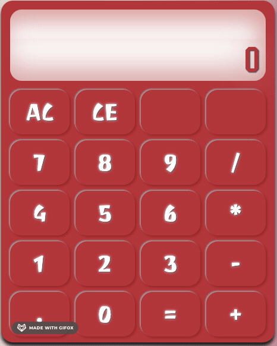
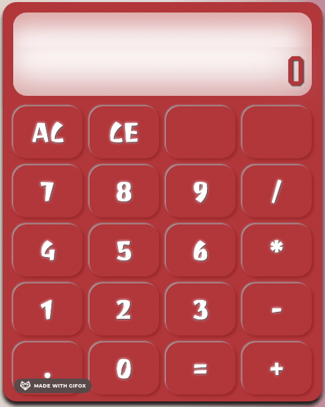
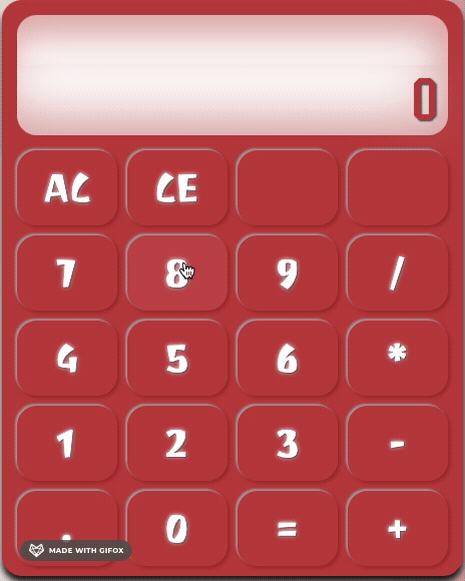
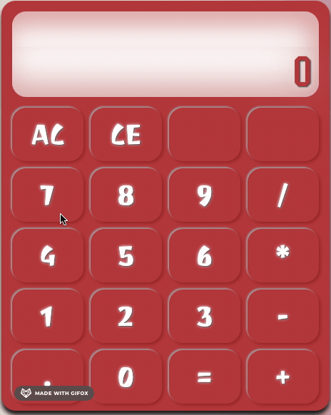

  <h1>Calculator</h1>

  A Browser Based On-Screen Calculator ([live preview](https://ohgrmait.github.io/calculator/))

  

## About
`calculator` is a funky looking browser-based on-screen calculator built using JavaScript, HTML and CSS. It allows for both mouse and keyboard support to perform different kinds of operations.[^1]

[^1]: [This project](https://www.theodinproject.com/lessons/foundations-calculator) is from the [Foundations Course](https://www.theodinproject.com/paths/foundations/courses/foundations) in [The Odin Project](https://www.theodinproject.com/about). This being the [capstone project](https://dev.to/theodinproject/learning-code-f56#:~:text=Always%20spend%20extra%20time%20on%20capstone%20projects) of the Foundations Course, I did put in a considerable amount of effort to make it look nice.

## Features

- ***Allows for both mouse and keyboard support to enter numbers and perform operations.***
- ***Performs basic math operations like addition, subtraction, multiplication, and division.***
- ***Allows for integers and floating-point numbers with results in scientific notation.***
- ***Has a AC button that is analogous to ALL CLEAR in old and modern-day calculators.***
- ***Has a CE button that is analogous to CLEAR ENTRY in old and modern-day calculators.***
- ***Does not evaluate more than a single pair of numbers at a time: no operator precedence.***
- ***Pressing the = key or any of the operator keys without entering numbers gives an error.***
- ***Causes a snarky (and funky) explosion if the user tries to perform division by zero.***

## Showcase

  
  

  
This is a screenshot of the index page.

  

    
    
    
This is a screen cast of the zero division error and random word error.

  

  
  

    
    
    
This is a screen cast of an operation from mouse and an operation from keyboard.

  

    
    
    
This is a screen cast of the AC and CE button that clears entries and workspace.

  

## Technologies
- ***Git***
- ***CLI***
- ***HTML***
- ***GitHub***
- ***JavaScript***
- ***GitHub Pages***

## Self Reflections
- > As of now, this is the hardest project that I've worked upon (much worse and time-consuming than my [previous project](https://github.com/ohgrmait/etch-a-sketch)). It took several days: initially it felt impossible because there was lesser hand-holding in the project specs but my persistence and grit got me to the finish line. **In the end, a lot of features creeped in and a lot of bugs were left unfixed. So unless some of the bugs are major and glaringly obvious, I don't think I will be fixing them anymore because I'm happy with what I've achieved.**

- > I learned the basics of objects before starting this project. My main resources that proved to be lifesavers were good old [google](https://www.google.com/), [stack overflow](https://stackoverflow.com/), [MDN web docs](https://developer.mozilla.org/en-US/), [DevDocs](https://devdocs.io/), and [TOP's discord server](https://discord.com/invite/fbFCkYabZB). I had to do a heavy amount of research because I kept finding bugs and then fixing them. This debugging process was extermely strenous but it forced me to use the [JavaScript developer tools](https://developer.chrome.com/docs/devtools/javascript). Most importantly, a lot of this was inspired from [Manon Lef's calculator](https://manonlef.github.io/calculator/) - this definitely made me want to make out a more fleshed-out version of a calculator with some fancy bells and whistles.

## Acknowledgements
- Credit for the audio goes to [freesound_community](https://pixabay.com/users/freesound_community-46691455/) ([pixabay](https://pixabay.com/sound-effects/)).
- Credit for the inspiration in parts of the design process goes to [Manon Lef's calculator](https://manonlef.github.io/calculator/).
- Credit for README goes to [ritaly's README cheatsheet](https://github.com/ritaly/README-cheatsheet) and [ArjunSaili1's comment](https://github.com/TheOdinProject/curriculum/discussions/25472#discussioncomment-5889343).

## Contact and Support
- Please do not hesitate to contact me at ***ohgrmait_02945*** on discord for any project queries.
- This project will no longer be worked upon and no further support will be provided for this project.[^2]

[^2]: The [TOP strategy guide](https://dev.to/theodinproject/learning-code-f56) makes it clear to [focus on the point of the assignment](https://dev.to/theodinproject/learning-code-f56#:~:text=Focus%20on%20the%20point%20of%20the%20assignment) and that [foundations isn't a strong portfolio generator](https://dev.to/theodinproject/learning-code-f56#:~:text=Foundations%20isn%E2%80%99t%20a%20strong%20portfolio%20generator), so I won't be wasting anymore time here.